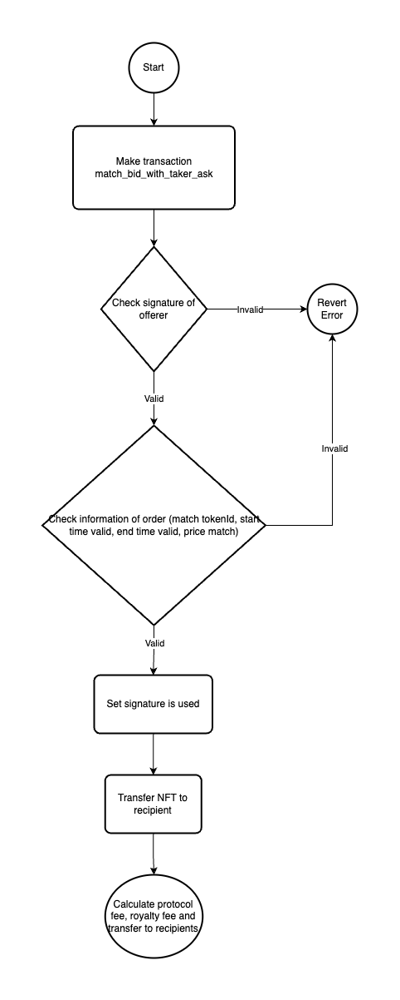

# Flex Contracts Monorepo

## Repository Structure

The repository is organized into the following directories:


-   `stakingpool`: Includes implementation of the staking NFT pool contracts.
-   `openedition`: Includes implementation of open-editions NFT minting mechanism contracts.
-   ## Overview
This contains smart contracts for minting Openedition NFTs. The contracts are designed to handle the minting process, manage phases, and control access through various security components. 


### ERC721 Contract
The `ERC721` contract implements the ERC721 token standard with additional functionalities tailored for Open Edition NFT minting. It leverages components from OpenZeppelin and Alexandria Storage for enhanced features and security.

- **Purpose**: This handles standard ERC721 NFT operations with extensions for Open Edition minting.
- **Key Features**:
  - **ERC721Component**: Implements core ERC721 functionalities and Open Edition methods.
  - **SRC5Component**: Adheres to SRC5 standards for extended capabilities.
  - **OwnableComponent**: Manages contract ownership and permissions.
  - **ReentrancyGuardComponent**: Provides protection against reentrancy attacks.
- **Storage**: Tracks token IDs, allowed FlexDrop addresses, total minted tokens, and phase information.
- **Functions**:
  - **update_allowed_flex_drop**: Updates the list of authorized FlexDrop addresses.
  - **mint_flex_drop**: Mints tokens through approved FlexDrop addresses.
  - **create_new_phase_drop**: Initiates new minting phases.
  - **update_phase_drop**: Modifies existing minting phases.
  - **multi_configure**: Allows batch configuration for various settings.

### ERC721OpenEditionMultiMetadata
The `ERC721OpenEditionMultiMetadata` contract extends the ERC721 functionality to support multiple metadata types and is designed for Starknet. It integrates components from Alexandria Storage and OpenZeppelin.

- **Purpose**: Manages ERC721 tokens with multi-metadata support on Starknet.
- **Key Features**:
  - **SRC5Component**: Manages SRC-5 standards specific to Starknet.
  - **ERC721MultiMetadataComponent**: Adds support for multiple metadata types.
  - **OwnableComponent**: Controls ownership of the contract.
  - **ReentrancyGuardComponent**: Protects against reentrancy attacks.
- **Storage**: Similar to `ERC721`, but includes support for multiple metadata types and phase management.
- **Functions**:
  - **update_allowed_flex_drop**: Allows updates to allowed FlexDrop addresses.
  - **mint_flex_drop**: Facilitates token minting through FlexDrop addresses.
  - **create_new_phase_drop**: Starts new phases for token distribution.
  - **multi_configure**: Configures multiple settings in one call.

## FlexDrop Contract
The `FlexDrop` contract is designed for managing flexible token drops and integrates with ERC20 and other components for comprehensive management of minting phases and user access.

- **Purpose**: Manages the minting process for NFTs, including flexible drop phases and user whitelisting.
- **Key Features**:
  - **OwnableComponent**: Manages contract ownership.
  - **PausableComponent**: Allows pausing and resuming of contract functions.
  - **ReentrancyGuardComponent**: Protects against reentrancy attacks.
- **Storage**: Maintains data on phase drops, creator payouts, protocol fees, and whitelist validation.
- **Functions**:
  - **mint_public**: Allows public minting during active phases.
  - **whitelist_mint**: Handles minting for users on the whitelist.
  - **start_new_phase_drop**: Initiates new minting phases with validation.
  - **update_phase_drop**: Updates details of existing phases.
  - **update_creator_payout_address**: Adjusts creator payout addresses.
  - **update_payer**: Manages allowed payer addresses for minting fees.
  - **pause/unpause**: Controls the contract's active status.

Each contract is designed to work seamlessly within the broader ecosystem, ensuring secure and flexible NFT minting processes.

-   `marketplace`: Includes implementation of the marketplace contracts.

1. `stakingpool`: Includes implementation of the staking NFT pool contracts.
#### Overview
The `StakingPool` contract allows users to stake their NFTs (ERC721 tokens) from specified eligible collections and earn rewards over time. This mechanism is designed to incentivize NFT holders by rewarding them based on the duration their NFTs remain staked.

#### Key Features

- **NFT Staking:** Users can stake their NFTs from collections that are approved by the contract owner.
- **Reward Accumulation:** Rewards are earned based on the amount of time an NFT is staked. The longer an NFT is staked, the more rewards it accrues.
- **Flexibility:** The contract supports various NFT collections, each with customizable reward parameters set by the contract owner.

#### Staking Process

 **Stake an NFT:**
   - Users call the `stakeNFT` function, providing the collection address and the token ID of the NFT they wish to stake.
   - Once staked, the NFT is locked in the contract and cannot be transferred until it is unstaked.

 **Unstake an NFT:**
   - Users can call the `unstakeNFT` function to retrieve their staked NFT.
   - During the unstaking process, any accumulated rewards are claimed and credited to the user.

 **Claiming Rewards:**
   - Rewards are calculated based on the staking duration and the reward rate set for the NFT collection.
   - Users can view their accumulated rewards for each staked NFT using the `getUserPointByItem` function.

#### Contract Configuration

- **Eligible Collections:** Only NFTs from collections that have been approved by the contract owner can be staked.
- **Reward Calculation:** The contract owner sets the time unit (in seconds) and the reward per unit time for each collection. These parameters determine how rewards accumulate for staked NFTs.

#### Security Considerations

- The contract implements reentrancy protection to secure staking and unstaking operations.
- Only the contract owner has the authority to modify which NFT collections are eligible for staking and to set the reward parameters.

2. `openedition`: Includes implementation of open-editions NFT minting mechanism contracts.
3. `marketplace`: Includes implementation of the marketplace contracts.


#### Development Setup

You will need to have Scarb and Starknet Foundry installed on your system. Refer to the documentations below:

-   [Starknet Foundry](https://foundry-rs.github.io/starknet-foundry/index.html)
-   [Scarb](https://docs.swmansion.com/scarb/download.html)

To use this repository, first clone it:

```
git clone git@github.com:Flex-NFT-Marketplace/Flex-Marketplace-Contract.git
```

### Building contracts

To build the contracts, run the command:

```
scarb build
```

Note: Use scarb version `2.6.3`.

### Running Tests

To run the tests contained within the `tests` folder, run the command:

```
scarb test
```

### Marketplace Contracts

#### Overview


#### Listing


#### Buy


#### Make Offer


#### Accept Offer
